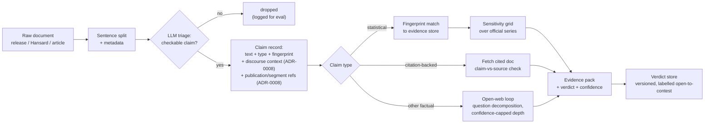
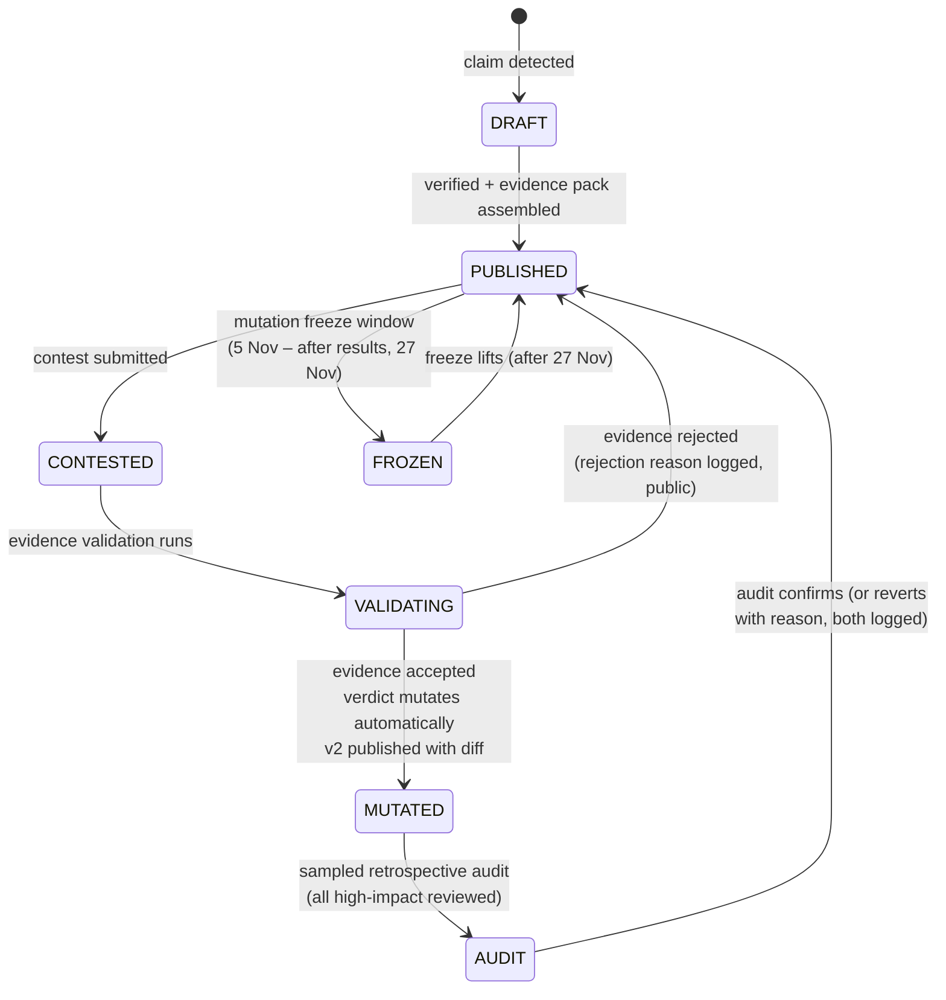
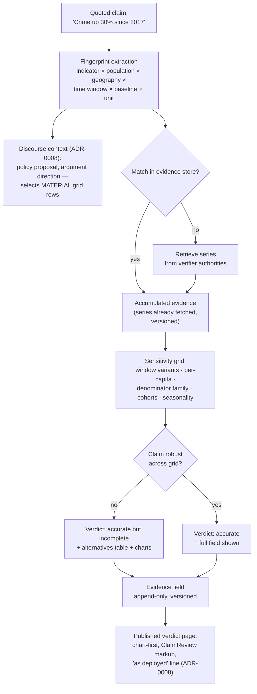
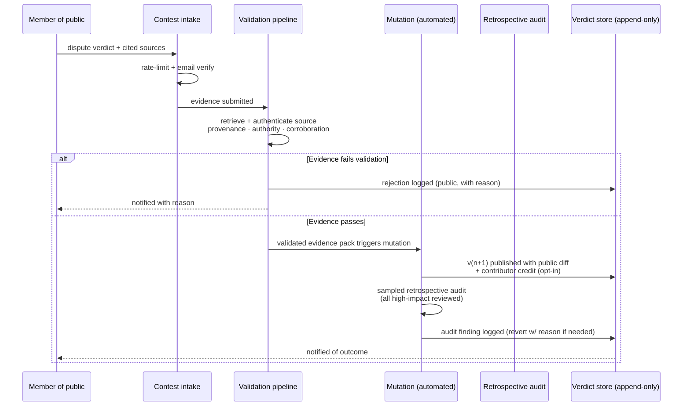

# Architecture

*Proposed design, pre-implementation. Each major decision has an ADR in [`adr/`](adr/). Diagrams are inline Mermaid (rendered natively by GitHub); PNG exports in [`diagrams/`](diagrams/).*

## 1. System context

ClaimWatch sits between NZ's open political-data infrastructure and the public. Two kinds of external relationship, deliberately kept distinct: **claim sources** — publications whose claims flow *into* the pipeline and get checked — and **verifier authorities** — official data/record sources consulted as *evidence*, never treated as claims to check. A claim source is something we are prepared to disagree with; a verifier authority is something independently assessed as trustworthy for its domain (the T1–T6 map in `SOURCE-TAXONOMY.md` §2.1). A Stats NZ data table is never triaged as a document that might contain a politician's claims; a press release is never consulted as evidence for its own statistics. The distinction is structural: claim-source content enters the evidence store only through claim extraction; authority content enters only as referenced evidence items. Hansard and Beehive overlap deliberately — the role is per-artefact by document type (a minister's Hansard statement is a claim source; the Hansard record of *who said what when* is also attribution evidence). The ADR-0013 proposal pathway governs what counts as an authority and what gets ingested.

Verifier authorities are deliberately limited to public, structured, official data for v1 (ADR-0006); social platforms are excluded from claim sources too. The verification engine reads official series directly rather than relying on what a release cited (ADR-0005) — the citing politician chooses the evidence; we reconstruct the field.

## 2. Pipeline dataflow

Three verification modes by claim class (ADR-0005). Statistical claims resolve against the claim-anchored evidence store; citation-backed claims get a bounded claim-vs-source comparison; everything else gets the open-web loop with confidence-capped retrieval depth — AVeriTeC shows this mode is the least reliable, so it is capped, labelled, and its verdicts are the most visibly "open to contest."

## 3. Verdict lifecycle (the mutation model)

Every transition is logged; nothing is ever silently edited (ADR-0001, ADR-0002). A validated evidence pack triggers mutation automatically; a sampled retrospective audit checks validator quality without gating it (ADR-0002). The freeze is the design response to Electoral Act s 199A (`LEGAL-COMPLIANCE.md` §1).

## 4. The statistical-claim engine

The claim is often true — the verdict is about the *representativeness of the framing*, assessed against the claim's discourse context: the proposal it supports and its argument direction determine which grid rows are material to the deployment, while the grid itself stays pre-declared and identical for every claimant (the defence against "you invented the standard to hurt us"; ADR-0005). Series accumulate from real claims, so repeat and adjacent claims resolve from stored evidence. Grading: `EVALUATION.md`.

## 5. Contestation → validation → mutation

The validation step is the anti-brigading mechanism in v1 (ADR-0002): submitted noise must survive provenance checks to matter, so volume attacks die in quality gates rather than vote arithmetic. Every rejection is public and reasoned, keeping bad-faith patterns visible.

## 6. What we are explicitly NOT building for 2026

- Parliament TV / broadcast transcription — publisher transcripts/captions only; self-generated transcription out of scope (ADR-0007)
- Social-platform firehose ingestion
- Bridging-weighted community rating (post-election, with data to justify it — ADR-0002)
- Māori-language claim processing (acknowledged gap; roadmap item with iwi/kaupapa partners)
- Auto-publishing verdicts without the contest pathway
- Pre-computed topic packs (superseded by the claim-anchored evidence store — ADR-0005)

## 7. Hosting and operations

Self-hosted on the existing Proxmox cluster behind Cloudflare; zero cloud vendor lock-in for site and data. Paid services: LLM API + search API only. The verdict store, audit log, and labelled datasets are the durable assets, backed up outside the election-window lifecycle. Pipeline observability is Grafana-only (ADR-0012).

## 8. Implementation stack

TypeScript (Vercel AI SDK, no orchestration framework), Postgres as the single data plane (pgvector + FTS + pg_cron), Drizzle schema/migrations — per ADR-0014. The validation slice (`VALIDATION-SLICE.md`) is the first build target.

## 9. Diagram index

| Diagram | File |
|---|---|
| System context | `docs/diagrams/system-context.png` |
| Pipeline dataflow | `docs/diagrams/pipeline-dataflow.png` |
| Verdict state machine | `docs/diagrams/verdict-lifecycle.png` |
| Contest → mutation sequence | `docs/diagrams/contestation-sequence.png` |