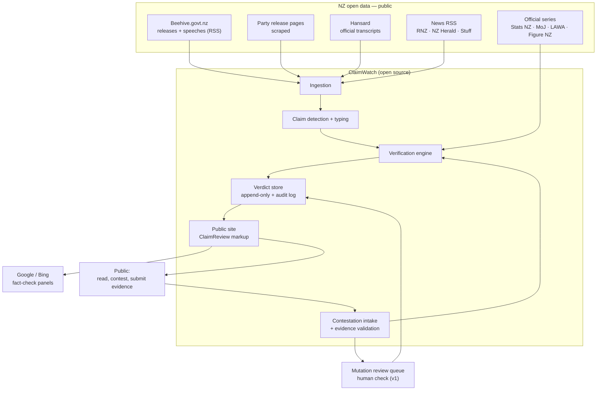
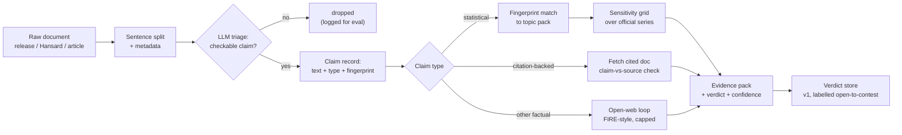
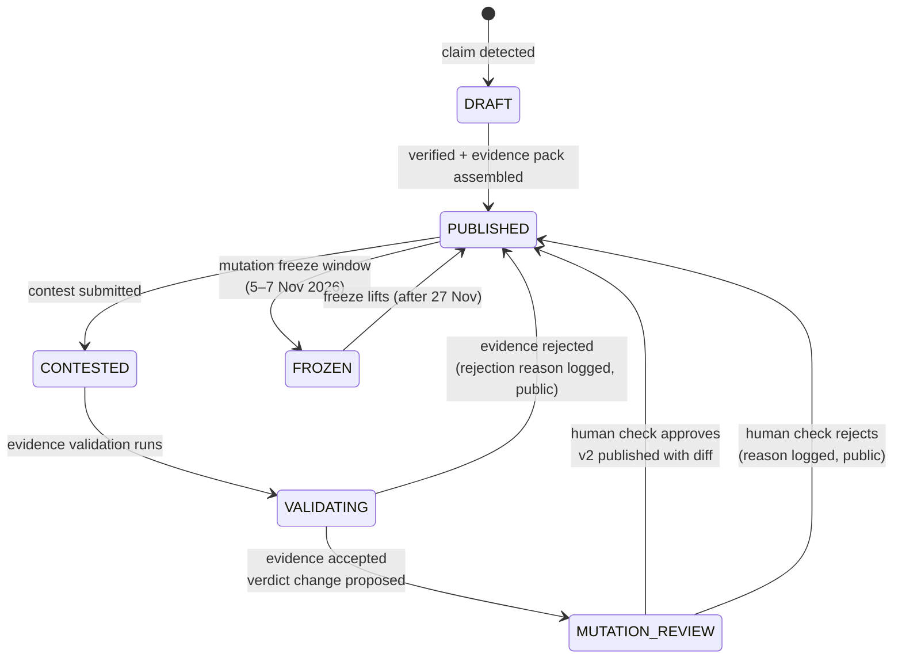
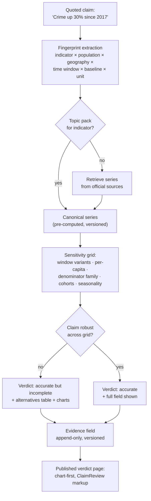
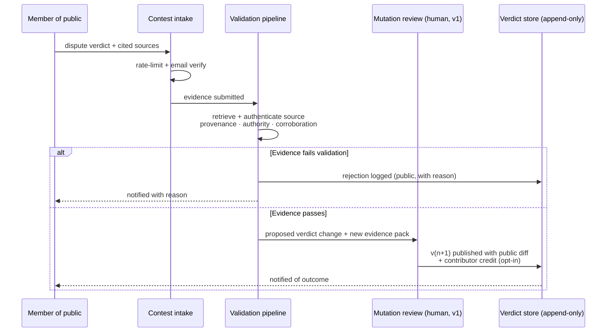

# Architecture

*Status: proposed design, pre-implementation. Each major decision has an ADR in [`adr/`](adr/). Diagrams are inline Mermaid (rendered natively by GitHub); PNG exports live in [`diagrams/`](diagrams/).*

---

## 1. System context

ClaimWatch NZ sits between NZ's open political-data infrastructure and the public. Everything flowing in is public data; everything flowing out is public, versioned, and contestable.

**Reasoning:** sources are deliberately limited to public, structured, official data for v1 (ADR-002). Social platforms are excluded — API costs and gating are high, and Hansard + releases + news cover the bulk of claimable on-record material. The verification engine reads official statistical series directly rather than relying on what a release cited (ADR-004) — the citing politician chooses the evidence; we reconstruct the field.

## 2. Pipeline dataflow

**Reasoning:** three verification modes by claim class (ADR-004). Statistical claims go against pre-computed topic packs (fastest, highest accuracy); citation-backed claims get a bounded claim-vs-source comparison; everything else gets the general open-web loop with a strict step budget — we know from AVeriTeC that this mode is the least reliable, so it is capped, labelled, and its verdicts are the most visibly "open to contest."

## 3. Verdict lifecycle (the mutation model)

**Reasoning:** every transition is logged; nothing is ever silently edited (ADR-001, ADR-006). The freeze window is the legal design response to Electoral Act s 199A (see legal doc). In v1 the "human check" is a small daily review task by the operator; the post-election design replaces this with bridging-weighted community review (ADR-005).

## 4. The statistical-claim engine (flagship)

**Reasoning:** the claim itself is true — the verdict is about the *representativeness of the framing*. A pre-declared, published sensitivity grid makes the judgment criterion explicit and identical for every party and claim (this is the defence against "you invented the standard to hurt us"). Topic packs turn live verification into lookup + arithmetic against official data, which is where our accuracy will be highest. See ADR-004 and `docs/EVALUATION.md` for how this is graded.

## 5. Contestation → validation → mutation

**Reasoning:** the validation step is the anti-brigading mechanism in v1 (ADR-005) — noise can be submitted but must survive provenance checks to matter, so volume attacks are neutralised by quality gates rather than by vote arithmetic. Every rejection is public and reasoned, which keeps the process auditable and keeps bad-faith actors visible.

## 6. What we are explicitly NOT building for 2026

- Parliament TV / broadcast transcription (ADR-002)
- Social-platform firehose ingestion
- Bridging-weighted community rating (post-election, with data to justify it — ADR-005)
- Māori-language claim processing (acknowledged gap; roadmap item with iwi/kaupapa partners)
- Auto-publishing verdicts without the contest pathway

## 7. Hosting and operations

Self-hosted on existing infrastructure (Proxmox cluster) behind Cloudflare; zero cloud vendor lock-in for the site and data. Paid services: LLM API + search API only. The verdict store, audit log, and labelled datasets are the durable assets and are backed up outside the election window lifecycle.

## 8. Diagram index

| Diagram | File |
|---|---|
| System context | `docs/diagrams/system-context.png` |
| Pipeline dataflow | `docs/diagrams/pipeline-dataflow.png` |
| Verdict state machine | `docs/diagrams/verdict-lifecycle.png` |
| Contest → mutation sequence | `docs/diagrams/contestation-sequence.png` |