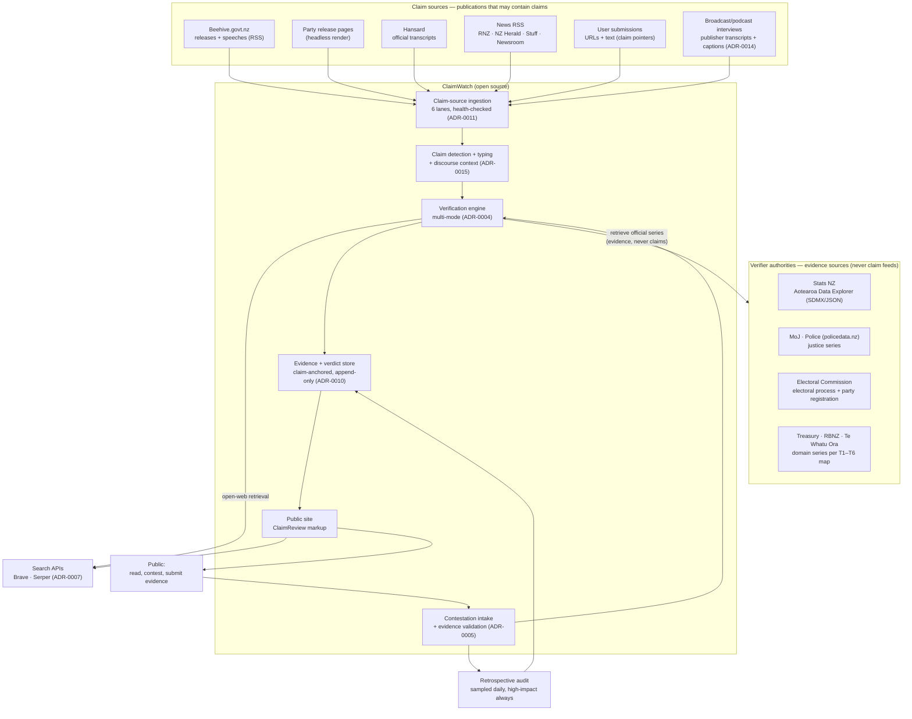
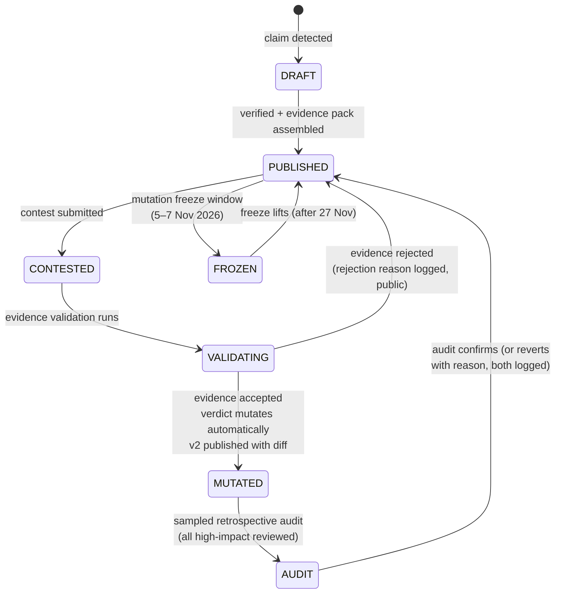
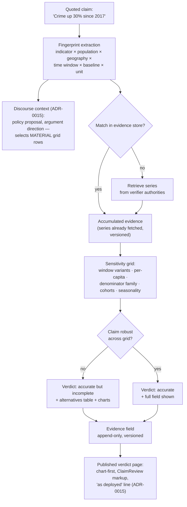
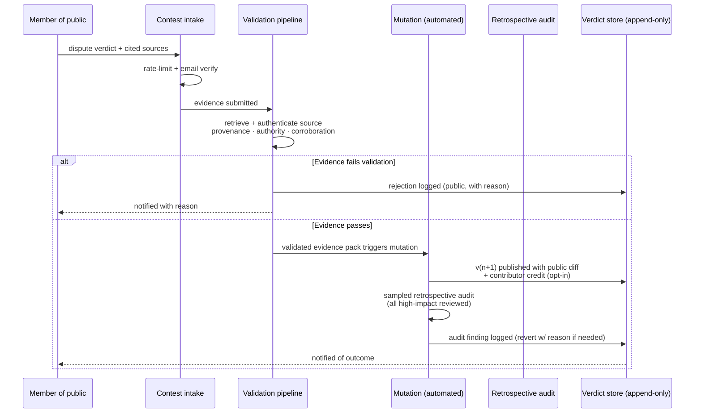

# Architecture

*Status: proposed design, pre-implementation. Each major decision has an ADR in [`adr/`](adr/). Diagrams are inline Mermaid (rendered natively by GitHub); PNG exports live in [`diagrams/`](diagrams/).*

---

## 1. System context

ClaimWatch NZ sits between NZ's open political-data infrastructure and the public. The system has **two distinct kinds of external relationship**: **claim sources** — publications that may contain claims needing verification (they flow *into* the pipeline) — and **verifier authorities** — official data and record sources whose published series, statistics, and records are the *evidence* claims are checked against (the verification engine consults them; their content is never treated as claims to be checked). Keeping the two roles distinct is a design principle, not an accident of the diagrams: a claim source is something we are prepared to disagree with; a verifier authority is something we have independently assessed as trustworthy for its domain (the T1–T6 map in [`docs/SOURCE-TAXONOMY.md`](SOURCE-TAXONOMY.md)).

**Reasoning:** claim sources and verifier authorities are deliberately kept as separate subgraphs with separate flows. Claim sources flow through ingestion into claim detection; verifier authorities are **consulted by the verification engine as evidence** — a one-directional evidence lookup, never a claim feed. A Stats NZ data table is never triaged as a document that might contain a politician's claims; a press release is never consulted as evidence for its own statistics. The distinction is enforceable structurally: claim-source content enters the evidence store only through claim extraction; authority content enters the evidence store only as referenced evidence items. Sources are deliberately limited to public, structured, official data for v1 (ADR-0002); social platforms are excluded. The verification engine reads official series directly rather than relying on what a release cited (ADR-0004) — the citing politician chooses the evidence; we reconstruct the field.

Note the one deliberate overlap: Hansard and Beehive releases appear in the claim-source graph **and** their underlying data/records can serve as evidence. The role is determined per-artefact by document type (a minister's statement in Hansard is a claim source; the Hansard record *of who said what and when* is also attribution evidence; a MoJ statistics table is pure evidence). The ADR-0009 authority-proposal pathway governs what counts as an authority; the claim-source pathway (also ADR-0009) governs what gets ingested.

## 2. Pipeline dataflow

**Reasoning:** three verification modes by claim class (ADR-0004). Statistical claims resolve against the claim-anchored evidence store (fast, high accuracy, compounding — see ADR-0010); citation-backed claims get a bounded claim-vs-source comparison; everything else gets the general open-web loop with question decomposition and confidence-capped retrieval depth (per ADR-0011's evidence-base findings) — we know from AVeriTeC that this mode is the least reliable, so it is capped, labelled, and its verdicts are the most visibly "open to contest." Every claim carries its publication/segment references and discourse window (ADR-0015/0016), available to the verifier on demand up to full-document depth.

## 3. Verdict lifecycle (the mutation model)

**Reasoning:** every transition is logged; nothing is ever silently edited (ADR-0001, ADR-0006). Mutation is fully automated — a validated evidence pack triggers the change, and a sampled retrospective audit (all high-impact mutations reviewed) checks validator quality without gating it (ADR-0005). The freeze window is the legal design response to Electoral Act s 199A (see legal doc).

## 4. The statistical-claim engine (the primary mode for statistical claims)

**Reasoning:** the claim itself is often true — the verdict is about the *representativeness of the framing*, and (per ADR-0015) the framing is assessed against the claim's discourse context: the policy proposal it supports and its argument direction determine which grid rows are material to the deployment, while the grid itself stays pre-declared and identical for every claimant (the defence against "you invented the standard to hurt us"). The claim-anchored evidence store turns live verification into fingerprint-match + arithmetic against official data — series accumulate from real claims, so repeat and adjacent claims resolve from stored evidence (ADR-0010). See ADR-0004 and `docs/EVALUATION.md` for how this is graded.

## 5. Contestation → validation → mutation

**Reasoning:** the validation step is the anti-brigading mechanism in v1 (ADR-0005) — noise can be submitted but must survive provenance checks to matter, so volume attacks are neutralised by quality gates rather than by vote arithmetic. Every rejection is public and reasoned, which keeps the process auditable and keeps bad-faith actors visible.

## 6. What we are explicitly NOT building for 2026

- Parliament TV / broadcast transcription — broadcast claims enter via publisher transcripts/captions only; **self-generated transcription is out of scope** (ADR-0014)
- Social-platform firehose ingestion
- Bridging-weighted community rating (post-election, with data to justify it — ADR-0005)
- Māori-language claim processing (acknowledged gap; roadmap item with iwi/kaupapa partners)
- Auto-publishing verdicts without the contest pathway
- Pre-computed topic packs (superseded by the claim-anchored evidence store — ADR-0010)

## 7. Hosting and operations

Self-hosted on existing infrastructure (Proxmox cluster) behind Cloudflare; zero cloud vendor lock-in for the site and data. Paid services: LLM API + search API only. The verdict store, audit log, and labelled datasets are the durable assets and are backed up outside the election window lifecycle. Pipeline observability is Grafana-only (ADR-0012).

## 8. Implementation stack

TypeScript (Vercel AI SDK, no orchestration framework), Postgres as the single data plane (pgvector + FTS + pg_cron), Drizzle schema/migrations — per ADR-0013. The validation slice (ingest Beehive/RNZ/Stuff → triage → verify → store → AVeriTeC export → cost telemetry) is the first build target.

## 9. Diagram index

| Diagram | File |
|---|---|
| System context | `docs/diagrams/system-context.png` |
| Pipeline dataflow | `docs/diagrams/pipeline-dataflow.png` |
| Verdict state machine | `docs/diagrams/verdict-lifecycle.png` |
| Contest → mutation sequence | `docs/diagrams/contestation-sequence.png` |