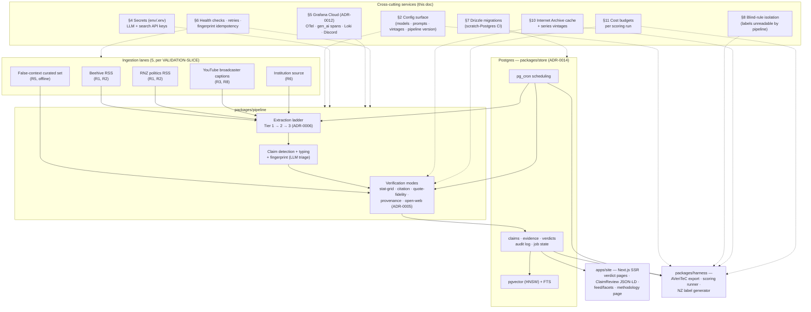

# Cross-cutting design

*Status: proposed. Companion docs: docs/ARCHITECTURE.md, docs/VALIDATION-SLICE.md, docs/TEST-STRATEGY.md, docs/design/* (component designs). ADRs: 0005, 0006, 0011, 0012, 0014.*

This document covers the concerns that span every pipeline component: configuration, prompts, secrets, observability, error handling, schema policy, the blind-rule boundary, environments, backups, and cost. It does not re-derive component behaviour — it defines the shared mechanisms components must use, and the test posture for each. Per ADR-0014, the stack is TypeScript (Vercel AI SDK), Postgres (pgvector + FTS + pg_cron), Drizzle migrations, pnpm monorepo (`packages/pipeline`, `packages/store`, `packages/llm`, `packages/harness`, `apps/site`). Test layers L1–L4 refer to docs/TEST-STRATEGY.md §2.

---

## 1. Component map (one Mermaid flowchart of the slice: ingestion lanes → triage → verification modes → store → site + harness; annotate the cross-cutting services touching each)

Every cross-cutting service touches more than one component by definition; the dotted edges mark the load-bearing attachments. The harness is a *consumer* of the store and config, never of the pipeline's runtime process — that separation is what §8 makes structural.

**Test risks & strategy (component map):**
- Risk: the map drifts from reality (a lane or mode added without wiring its cross-cutting services). Mitigation: L1 asserts each lane emits funnel events + gen_ai spans at instantiation (ADR-0012's "instrumentation ships with each lane" rule is a test, not a convention); §5's reconciliation job catches store/dashboard drift.
- Risk: harness accidentally coupled to pipeline runtime (importing pipeline code), breaking the blind boundary. Mitigation: L1 dependency-direction test (`packages/harness` must not import `packages/pipeline`); §8.

---

## 2. Configuration & pinning (model versions, prompt versions, data vintages, pipeline version — single config surface; the reproducibility contract for scoring runs)

A single config surface in-repo (typed, loaded by `packages/llm` and the harness) carries every value a scoring run depends on:

| Config key | Set by | Consumed by | Change gated by |
|---|---|---|---|
| `models.{role}` (per ADR-0011 routing table) | Harness decision / routing config PR | pipeline, harness | L3 run; ADR-0011 decision rule |
| `model_versions.{role}` (pinned provider version string) | same | pipeline, harness | same |
| `prompts.{task}` (version ref → §3 files) | prompt PR | pipeline, harness | L2 snapshot diff |
| `grid_axes_version` (pre-declared axes, ADR-0005) | methodology PR | stat engine, harness | L2 + L3 |
| `data_vintages` (series vintage per authority; evidence-URL snapshot set) | harness run manifest | harness, site methodology page | n/a (pinned per run) |
| `pipeline_version` (package version + git SHA) | build | every stored artefact's provenance fields | n/a (derived) |
| `search_config` (provider, authority-restriction maps) | config PR | pipeline | L2 |
| `latency_class` routing (batch vs interactive, ADR-0011) | config PR | job scheduler | L1 |

**The reproducibility contract:** a scoring run's output is stamped with the tuple `(pipeline_version, model_versions, prompt_versions, grid_axes_version, data_vintages, search_config)`. The site's methodology page renders the published accuracy table *from the harness output file carrying that tuple* — the published number is generated, never hand-edited (TEST-STRATEGY §2 L4). No provider silent upgrades: ADR-0011 pins versions and any provider model-version change re-runs the harness before adoption.

Open question on vintage pinning mechanics → §14.

**Test risks & strategy:**
- Risk: a config default (model or prompt version) silently differs between dev, CI, and the slice environment. Mitigation: L1 asserts the effective config is fully resolved and matches a checked-in expected tuple; L2 golden runs pin the tuple, so drift produces a visible verdict diff.
- Risk: scoring-run outputs missing provenance tuple → unreproducible published numbers. Mitigation: L1 schema test — harness output without the full tuple fails to validate; L4a asserts the methodology table renders only from tuple-carrying files.
- Risk: provider silently upgrades a model (ADR-0011's named hazard). Mitigation: L2 snapshots per PR catch behavioural drift; L3 re-run on any version change per ADR-0011.

---

## 3. Prompt management (versioning, storage, published prompts, change = PR, link to golden-set snapshots)

Prompts are code (ADR-0012): versioned files under `packages/llm/prompts/`, one file per pipeline role (triage, fingerprint extraction, citation check, quote-fidelity, adjudication, NLI audit, second-opinion). Properties:

- **Change = PR.** Git history is the prompt-version record; no vendor prompt UI, deliberately (ADR-0011 treats prompt changes as model-equivalent changes).
- **Every stored artefact and harness output records the prompt version(s) used** — prompt versions are first-class provenance, on par with model versions (§2 tuple).
- **Published prompts** on the methodology page — the exact prompt text a verdict used is inspectable, satisfying the site MVP's "pipeline provenance" block (VALIDATION-SLICE).
- **L2 link:** the ~20-claim golden set runs per PR with pinned prompts; any prompt edit produces a snapshot diff the reviewer reads *before* approving. A prompt change that changes a golden verdict without a deliberate justification does not merge.
- **Harness-gated per EVALUATION.md §4:** any prompt change re-runs L3; the per-stratum regression gate applies.

**Test risks & strategy:**
- Risk: prompt edited in code without bumping the version reference, so provenance lies. Mitigation: L1 asserts the prompt file hash matches the version recorded in config; L2 diff makes any mismatch visible.
- Risk: prompt drift between what ran in production and what the harness scored. Mitigation: the L2 golden run per PR uses the same config surface as production — one source, no copies.
- Risk: an unreviewed prompt tweak degrades a stratum silently. Mitigation: L3 per-stratum gate (−5 pts where n≥20; TEST-STRATEGY §3).

---

## 4. Secrets & API access (LLM + search API keys per ADR-0011; no keys in repo; local/prod separation)

Per ADR-0014: env + `.env` (gitignored), no Vault. The key surface is exactly the ADR-0011 providers actually routed: Anthropic, OpenAI, Google (Gemini), aggregator keys where used (OpenRouter/Fireworks/DeepInfra per routing), Brave Search API, Serper. Rules:

| Concern | Rule |
|---|---|
| Storage | `.env` locally; GitHub Actions secrets in CI; environment files on the slice host outside the repo |
| Repo hygiene | No key material in config files, prompts, fixtures, or test snapshots; `.env` in `.gitignore` from commit one |
| Scope | One key per provider per environment (dev / slice); no shared prod keys in dev |
| Rotation | Keys rotated if ever committed (the response to a leak is revoke + rotate, not history scrub) |
| Third-party egress | All payloads to model/search APIs are public material (claim text, public evidence, prompts) — ADR-0011's honest framing; no claim-submitter PII exists in the slice (no accounts) |
| Serving-mode pinning | Routing config records the aggregator serving mode (own infra vs passthrough-to-origin) per ADR-0011's foreign-operator rule; re-verified at the pre-campaign re-probe |

**Test risks & strategy:**
- Risk: a key committed to the repo. Mitigation: L1/CI secret-scanning step on every push (GHA-native); on detection: revoke + rotate. (Tooling choice → §14.)
- Risk: tests silently hitting paid APIs (cost + nondeterminism). Mitigation: L1 mocks all LLM/search calls; a CI assertion fails if any test environment resolves a live provider without an explicit `LIVE_EGRESS=1` flag.
- Risk: dev and slice environments sharing keys, so a dev mistake bills the campaign budget and pollutes cost telemetry. Mitigation: per-environment keys; §5 cost dashboards tag by environment; §11 budgets alert on unexpected spend.

---

## 5. Observability & cost telemetry (Grafana-only per ADR-0012; per-lane Tier-2 fallback rates; cost per claim per stratum; drop rates; what dashboards exist)

One platform, Grafana Cloud, instrumented once with OpenTelemetry (ADR-0012). Instrumentation ships with each lane: a lane without funnel events, gen_ai spans, and structured logs is not done. Dashboards:

| Dashboard | Panels | Feeds from |
|---|---|---|
| **Ingestion → publication funnel** | counts per stage × lane × source: fetched → extracted (tier 1/2/3) → attributed → deduped → triaged → queued → verified (per verdict class) → published | OTel stage-boundary events (live) + store-SQL view (historical truth), reconciled daily |
| **Extraction health** | Tier-2 fallback rate per lane (R7 — the markup-drift instrument), extraction-empty-from-known-nonempty rate, fetch success per source | funnel events |
| **Cost telemetry** | cost per role × model (gen_ai spans vs pricing); **cost per claim per stratum** (stratum tagged on spans at harness run time); aggregate vs the 80%-of-plan alert | `gen_ai.*` spans |
| **Verification quality tripwires** | verdict-class distribution shift, NLI audit failure rate, triage drop rate shift, repeat-occurrence ratio, unattributed rate | spans + store-SQL |
| **Job health** | pg_cron run history (`cron.job_run_details`), heartbeat/silence dead-man's-switch on nightly jobs | Postgres + synthetic monitoring |

Cost-per-claim-per-stratum is a harness-time computation: the harness tags each run's spans with stratum labels, and the dashboard aggregates spend ÷ claims per stratum — feeding the VALIDATION-SLICE deliverable table alongside accuracy. Drop rates (triage drop, extraction-empty, publish drop) are the funnel's named failure-mode instruments; each has a threshold or no-data alert routed to Discord (warnings batched; page-level conditions only, per ADR-0012's alert-fatigue constraint).

**Test risks & strategy:**
- Risk: a lane runs without emitting spans — invisible in every dashboard. Mitigation: L1 "instrumentation ships with the lane" test (funnel events + spans + log schema asserted per lane); the daily reconciliation job alerts on event-count vs store-count drift.
- Risk: cost telemetry miscalculates (stale pricing table, missing span fields) → cost dashboards lie. Mitigation: L1 unit tests on the cost-capture middleware with fixture pricing; L3 reports cost/claim independently from provider billing pages — the two are cross-checked at each harness run (drift → §11 anomaly alert).
- Risk: dashboards silently stop updating (free-tier limit hit — ADR-0012's named risk). Mitigation: no-data alerts on the key panels; the OTel instrumentation makes the self-hosted Grafana OSS migration a config change if limits bite.

---

## 6. Error handling, retries & idempotency (lane health checks, fetch retries, re-run safety — an ingest re-run must not duplicate claims; fingerprint dedup as the cross-component idempotency mechanism)

Per ADR-0006 the pipeline is idempotent at every stage boundary with raw inputs retained. The cross-component mechanisms:

| Mechanism | Scope | Behaviour |
|---|---|---|
| **Document content hash** | ingestion | Re-fetched document identical to a stored one → no new document row; provenance (retrieval timestamp) updated. Makes ingest re-runs free of duplicate documents. |
| **Claim fingerprint + embedding match** | triage / store | The dedupe-by-claim contract: a repeat claim gains a *source-occurrence*, never a new queue entry (ADR-0006). This is the cross-component idempotency mechanism — triage, verification, and the harness all key claims by fingerprint, so re-running any stage re-resolves to the same claim record. |
| **Append-only verdicts** | verification / store | Reprocessed verdicts append a new version with provenance; never overwrite. A changed verdict triggers the mutation flow with public diff (ADR-0006). |
| **Job idempotency keys** | scheduler | pg_cron-triggered jobs carry a run key; worker processes take advisory locks (ADR-0014) so concurrent re-runs don't double-verify. |
| **Fetch retry ladder** | all lanes | retry → headless fallback → degraded → maintainer alert → public coverage page (never silently absent, ADR-0006). |
| **Health checks** | lanes | liveness (200-but-zero-items is a distinct alarm), structural drift detection, volume anomaly bands; extraction failures alertable like fetch failures. |

**Ingest re-run invariant:** re-running any lane over the same sources yields the same claim set — no duplicate claims, no duplicate verdicts, at most new source-occurrences and updated provenance. This invariant is the slice's core idempotency guarantee and is directly tested.

**Test risks & strategy:**
- Risk: an ingest re-run duplicates claims (fingerprint instability — e.g. fingerprint normalisation changes between runs). Mitigation: L1 idempotency test — run ingestion twice over the same fixture corpus, assert identical claim counts and IDs; L2 golden set re-run asserts stable fingerprints.
- Risk: retry ladder infinite-loops or double-fetches on flaky sources. Mitigation: L1 tests with fixture HTTP failure modes (429, 5xx, bot-wall 200-with-block-page) asserting bounded retries and correct escalation.
- Risk: concurrent workers double-write verdicts (advisory-lock failure). Mitigation: L1 concurrency test on job idempotency keys; store unique constraints as the backstop (L1 schema tests).
- Risk: health checks exist but nobody notices a dead lane. Mitigation: L1 asserts each lane's monitor is registered; §5 silence alerts (dead-man's-switch) verified in the slice environment before launch.

---

## 7. Schema & migration policy (Drizzle migrations, schema versioning shared with harness labels, what changes require a harness re-run)

Per ADR-0014: typed Drizzle schema objects in `packages/store` shared end-to-end (pipeline writes, site reads, harness exports); migrations generated by drizzle-kit, reviewed as SQL in PRs, applied in order. The append-only store and permanent audit log demand forward-compatible evolution — never ad-hoc DDL.

**Shared versioning with the harness:** the label schema is part of the pipeline's storage schema — both define the claim/verdict/evidence objects; designed together, versioned together (TEST-STRATEGY §1's core principle). The harness export (AVeriTeC-format Dataset A/B + Layer-2 labels) carries a schema version; a store schema change that alters exported shapes bumps it.

**Migrations run in CI against a scratch Postgres before merge** — the schema-drift alarm.

**What requires a harness re-run (the L3 gate list):**

| Change | Re-run required? |
|---|---|
| Claim record / verdict / evidence export shape changes | Yes — harness reads and writes those shapes |
| Label schema change | Yes — plus published dataset version bump (EVALUATION §2.3) |
| Any prompt change | Yes (L2 first, then L3) |
| Any model/version change | Yes (ADR-0011) |
| Grid-axes definition change | Yes (ADR-0005: pre-declared, but a re-declaration is a pipeline change) |
| Retrieval source / authority map change | Yes (EVALUATION §4 names it) |
| Internal query/index changes with no exported-shape impact | No — CI scratch-Postgres migration + L1 suffices |
| Funnel view / dashboard changes | No — reconciliation job verifies store-agreement |

**Test risks & strategy:**
- Risk: a migration diverges between scratch CI Postgres and the slice environment (version mismatch, extension absence). Mitigation: CI runs migrations on a scratch Postgres pinned to the same version + extensions (pgvector, pg_cron) as the slice host; L1 smoke-test applies all migrations from zero on every PR.
- Risk: an append-only violation (migration backfills or mutates historical verdict rows). Mitigation: L1 migration-review checklist asserted in tests — any migration touching verdict/audit tables with UPDATE/DELETE fails review; the store exposes read-only historical views the tests exercise.
- Risk: harness and pipeline schema versions drift apart, so harness scores a shape production no longer emits. Mitigation: §2 tuple carries both versions; L1 asserts harness export schema version == store schema version; mismatch fails the run before scoring.

---

## 8. Blind-rule isolation (pipeline/labels access boundary — structural enforcement; summarise the mechanism, HARNESS.md owns the detail)

The blind rule (EVALUATION §3): the pipeline never accesses labels; labels never change to suit the pipeline. Enforced **structurally, not by convention** (TEST-STRATEGY §2 L3):

- Labels live on a separate storage path (separate Postgres role/database or filesystem directory) with **no read permission granted to the pipeline process identity** — the pipeline's DB role simply lacks GRANTs on label tables.
- The harness runs as a distinct process identity holding label read access; it reads labels and scores exported predictions, and nothing in `packages/harness` imports `packages/pipeline` (dependency-direction test, §1).
- Label *content* never enters pipeline-context retrieval paths: the evidence store and hybrid retrieval indexes exclude label-bearing tables by construction (indexes built only over pipeline-owned tables).

HARNESS.md owns the full mechanism detail (§2 blind-rule enforcement, HAR-R1). The cross-cutting commitments here: the boundary is testable from L1, and no §2 config surface item may leak label data into pipeline configuration.

**Test risks & strategy:**
- Risk: the boundary erodes — a pipeline worker granted label-table read for "convenience" during debugging and never revoked. Mitigation: L1 permission-assertion test run in CI against a migrated scratch DB: connect as the pipeline role, attempt label-table read, assert denial. Cheap and permanent.
- Risk: label content smuggled into pipeline context through config or fixtures. Mitigation: L1 asserts config surface schema has no label-typed fields; L2 fixtures are hand-curated claims only.
- Risk: harness code drifting into the pipeline package (shared helpers importing both ways). Mitigation: L1 dependency-direction test (`packages/pipeline` must not import `packages/harness` either — the firewall runs both ways, per ADR-0006's attribution firewall pattern).

---

## 9. Environments, deployment & hosting (Proxmox self-host + Cloudflare per ARCHITECTURE §7; dev/CI vs the slice environment; how scoring runs are triggered weekly + pre-release per TEST-STRATEGY D3)

Per ARCHITECTURE §7: self-hosted on the existing Proxmox cluster behind Cloudflare; zero cloud-vendor lock-in for site and data; paid services are LLM API + search API only (ADR-0011); observability on Grafana Cloud (ADR-0012).

| Environment | Where | Postgres | Secrets | LLM/search | Runs |
|---|---|---|---|---|---|
| Dev | workstation | local Postgres (docker) | local `.env` | mocked or real, per-test | L1 |
| CI (GitHub Actions) | managed runners | scratch Postgres (pinned version + extensions) | Actions secrets | mocked (L1/L2 via pinned snapshots) | L1 + L2 + L4a per PR |
| Slice | Proxmox VM behind Cloudflare | the homelab Postgres (pgvector, pg_cron) | host env files, outside repo | real APIs, batch-routed (ADR-0011) | live ingestion, site, L3, L4b |

**Scoring-run triggering (TEST-STRATEGY D3):** golden-set runs (L2) fire per PR in CI. Full two-layer runs (L3) run **weekly** and **pre-release** — triggered as a batch-eligible job (ADR-0011's `latency_class: batch`), scheduled in the slice environment (pg_cron trigger → harness worker process; pg_cron is the trigger and ledger, not the executor, per ADR-0014). A pre-release run is additionally a manual gate: a release tag's CI job requires a green L3 within the release window before the site deploy proceeds. Run outputs (accuracy tables + provenance tuple) land in versioned files the methodology page renders.

Deployment is intentionally boring: pnpm build → site served from the Proxmox VM behind Cloudflare; pipeline workers as containers on the same host; zero cloud vendor beyond the deliberate paid APIs and Grafana Cloud.

**Test risks & strategy:**
- Risk: environment parity drift — CI scratch Postgres differs from the slice host (version, extensions, locale) so migrations pass in CI and fail in production. Mitigation: pin CI Postgres to the slice host's version + extension set (§7); L4b smoke after each deploy.
- Risk: the weekly L3 silently stops running (the silence failure mode, ADR-0012). Mitigation: dead-man's-switch alert on the scoring job's heartbeat; a missed weekly run pages before anyone notices a stale methodology table.
- Risk: a release ships without a fresh harness run (stale published accuracy). Mitigation: L4a/L4b test asserting the methodology table's run timestamp is within the release's freshness window; the release gate fails otherwise.
- Risk: dev misconfig points at the slice Postgres (cross-environment contamination). Mitigation: per-environment connection config + §4 key scoping; L1 asserts the resolved environment matches the ambient flag.

---

## 10. Backups & evidence durability (Internet Archive caching, series vintages, verdict store + audit log as durable assets, backup schedule outside election lifecycle)

Durable assets (ARCHITECTURE §7): the verdict store, the audit log, and the labelled datasets. Evidence durability follows EVALUATION §2.2/§7:

- **Internet Archive caching:** evidence URLs cited in verdicts and labels are cached to the Internet Archive at verification/labelling time (AVeriTeC's own practice) — evidence must survive link rot for contestation and re-verification to be possible.
- **Series vintages:** statistical series stored with vintage dates ("as measured at publication"); nightly batch re-verification detects revisions (ADR-0005/§7 temporal-leakage controls).
- **Raw-document retention** (ADR-0006): the enabling cost for reprocessing; retained with provenance.
- **Backups:** nightly Postgres dumps (verdict store + audit log + job history), copied off-box (second Proxmox node or object storage); restore-tested, not just taken. The schedule runs **outside the election lifecycle** — backups are ordinary ops hygiene, not campaign-dependent, so the freeze-window crunch never competes with them.

**Test risks & strategy:**
- Risk: backups taken but unrestorable (the classic failure). Mitigation: scheduled restore test into a scratch Postgres (L1-scripted, run on an ops cadence); assert row counts + audit-log integrity post-restore.
- Risk: Internet Archive caching silently failing (rate limits, SPN errors), so "cached" evidence isn't. Mitigation: L1 fixture test on the cache step; §5 monitors cache-submission success rate with a no-data/threshold alert.
- Risk: vintage fields missing on stored series, making temporal-leakage controls (EVALUATION §7) vacuous. Mitigation: L1 schema constraint — series rows require a vintage; L3's re-verification detection depends on it.

---

## 11. Cost controls (budgets per scoring run, golden-set vs full-run tiers, alerting on run-cost anomalies)

The cost posture per ADR-0011/0012: tiered routing (cheap bulk roles, premium verdict roles), batch APIs for ~80–90% of token spend (≈40–45% effective discount), and cost telemetry from gen_ai spans.

| Control | Mechanism | Threshold |
|---|---|---|
| **Golden-set tier** | ~20 pinned claims, pennies, per PR (L2) | soft cap; a runaway L2 (bad retry loop) fails the PR on cost-estimate check |
| **Full-run tier** | L3 two-layer run, ~$10–20/run, weekly + pre-release | budget **$25/run hard cap** (TEST-STRATEGY §7.4); estimated cost is computed before the run and a run projecting over-cap requires explicit override |
| **Campaign budget** | ~$2–4K total cycle (ADR-0011 estimate) | **alert at 80% of the period's cost plan** (ADR-0012 committed alert) |
| **Run-cost anomaly alert** | cost/claim per stratum vs trailing baseline from §5 telemetry | anomalous stratum cost (e.g. a lane's retrieval depth blowing out) pages |
| **Batch discipline** | `latency_class` routing (§2); realtime reserved for publish-day high-impact verdicts | config-reviewed per ADR-0011; a realtime-lane spend spike is itself alertable |

**Test risks & strategy:**
- Risk: a runaway loop (retry storm, unbounded retrieval depth) silently burns budget. Mitigation: L1 bounds tests (confidence-capped depth asserted per ADR-0006's FIRE findings); pre-run cost projection blocks over-budget runs; §11 anomaly alert as the live backstop.
- Risk: cost telemetry undercounts (batch jobs, cache hits, aggregator fees not captured), so budgets read healthy while bills don't. Mitigation: L3's cost/claim cross-checked against provider billing at each run (§5); discrepancy > threshold pages.
- Risk: golden-set cost creeping up as prompts grow, making the per-PR gate expensive. Mitigation: L2 cost reported per run; trend visible on the cost dashboard; prompt-size regressions show as L2 cost deltas.

---

## 12. Test risks (table: | ID | Risk | Where it lives | Consequence if untested | Detection signal |)

| ID | Risk | Where it lives | Consequence if untested | Detection signal |
|---|---|---|---|---|
| CRO-R1 | Config tuple (models/prompts/vintages) diverges across dev/CI/slice | §2 config surface | Scoring runs unreproducible; published accuracy numbers unverifiable | L2 snapshot diff; L1 config-resolution test |
| CRO-R2 | Scoring-run output lacks provenance tuple | §2, §7 | Methodology page renders numbers with no reproducibility trail | L1 schema validation on harness output |
| CRO-R3 | Provider silently upgrades a model | §2, §4 | Behaviour changes without a harness gate — ADR-0011's named hazard | L2 golden drift; ADR-0011 re-run rule |
| CRO-R4 | Prompt file edited without version bump; provenance lies | §3 | Verdicts cite prompt versions they didn't use | L1 prompt-hash vs config assertion |
| CRO-R5 | API key committed to repo | §4 | Credential leak; cost/abuse exposure | CI secret-scanning step |
| CRO-R6 | Tests or dev silently hit paid APIs | §4 | Nondeterministic tests; surprise billing | L1 live-egress flag assertion |
| CRO-R7 | Lane ships without instrumentation | §5 | Silent funnel gaps; drift undetectable — the "fails silently" class ADR-0012 exists to kill | L1 instrumentation-completeness test per lane |
| CRO-R8 | Cost telemetry miscalculates or undercounts | §5, §11 | Budget decisions made on false numbers; run-cost anomaly undetected | L1 middleware tests; L3 vs billing cross-check |
| CRO-R9 | Ingest re-run duplicates claims | §6 | Corrupted claim graph, doubled verification spend, wrong occurrence counts | L1 double-run idempotency test |
| CRO-R10 | Retry ladder misbehaves on failure classes (infinite loop, double-fetch, silent degraded) | §6 | Sources silently degraded; duplicate fetches; alert fatigue | L1 failure-class fixture tests |
| CRO-R11 | Concurrent workers double-write verdicts | §6 | Append-only violated; audit log integrity broken | L1 concurrency test + store unique constraints |
| CRO-R12 | Migration breaks append-only guarantee (mutates verdict/audit history) | §7 | Permanent record corrupted; ADR-0002 contestability undermined | L1 migration checklist test (no DML on historical rows) |
| CRO-R13 | Store schema and harness label/export schema drift | §7 | Harness scores shapes production no longer emits; accuracy numbers measure the wrong system | L1 schema-version equality assertion |
| CRO-R14 | Blind-rule boundary eroded (pipeline reads labels) | §8 | Scoring runs tunable against labels — the harness stops measuring anything | L1 permission-denial test; dependency-direction test |
| CRO-R15 | Environment parity drift (CI vs slice Postgres) | §9 | Migrations pass in CI, fail in production; deploys fragile | Pinned CI Postgres; L4b post-deploy smoke |
| CRO-R16 | Weekly/pre-release scoring run silently skipped or stale | §9 | Published accuracy table goes stale without anyone noticing | Dead-man's-switch heartbeat; L4 release-gate timestamp assertion |
| CRO-R17 | Backups unrestorable; evidence caching silently failing; vintages missing | §10 | Evidence rot — contestation and re-verification impossible post-hoc; audit log lost | Restore tests; cache-alert; L1 vintage constraint |
| CRO-R18 | Runaway loop burns budget undetected | §11 | Campaign budget blown mid-cycle; harness runs unaffordable | L1 depth-bounds tests; pre-run cost projection; anomaly alert |

---

## 13. Test strategy (every §12 risk mitigated, mapped to layers L1–L4 and WHEN it runs; plus the consolidated test-risk register)

Layers per TEST-STRATEGY §2: **L1** deterministic tests, every push/CI; **L2** golden-set snapshots, every PR; **L3** accuracy harness, weekly + pre-release; **L4** site verification — L4a every push, L4b pre-release.

| Risk | Mitigating layer(s) | When it runs | Gate |
|---|---|---|---|
| CRO-R1 | L1 + L2 | Every push; every PR | CI must pass |
| CRO-R2 | L1 + L4a | Every push | CI must pass |
| CRO-R3 | L2 + L3 | Every PR; weekly + pre-release | L2 diff reviewed; L3 per-stratum gate |
| CRO-R4 | L1 | Every push | CI must pass |
| CRO-R5 | CI secret-scanning | Every push | CI must pass |
| CRO-R6 | L1 | Every push | CI must pass |
| CRO-R7 | L1 | Every push (per lane, at lane build time) | CI must pass |
| CRO-R8 | L1 + L3 | Every push; each scoring run | CI must pass; run cross-check |
| CRO-R9 | L1 + L2 | Every push; every PR | CI must pass |
| CRO-R10 | L1 | Every push | CI must pass |
| CRO-R11 | L1 | Every push | CI must pass |
| CRO-R12 | L1 (migration tests) | Every push (migrations run in CI scratch DB) | CI must pass |
| CRO-R13 | L1 + L3 | Every push; each run | CI must pass; run preflight |
| CRO-R14 | L1 | Every push | CI must pass |
| CRO-R15 | L1 + L4b | Every push (pinned CI DB); pre-release (deploy smoke) | CI; release gate |
| CRO-R16 | Ops monitors + L4 | Heartbeat continuous; L4a every push; release gate pre-release | Dead-man's-switch page; release gate |
| CRO-R17 | L1 + ops cadence | Vintage constraint every push; restore test + cache alert on ops schedule | Scheduled ops check |
| CRO-R18 | L1 + §5 telemetry | Every push (bounds tests); runtime (anomaly alert) | CI; Discord page |

### Consolidated test-risk register (all components)

One index of every component's risk IDs, with layer + gate. Layers per TEST-STRATEGY §2 (L1 deterministic, L2 golden-set, L3 accuracy harness, L4 site verification); gates: CI per push/PR, L3 per-stratum gate, L4b release gate. This table is the single index a reviewer reads to know "what must pass before merge, for which risk."

| Component doc | Risk IDs | Layers | Merge gate |
|---|---|---|---|
| docs/design/INGESTION.md | ING-R1 … ING-R14 | L1 (all); L2 (R1, R7, R11); L4a (R4) | CI every push; golden diffs per PR |
| docs/design/TRIAGE.md | TRI-R1 … TRI-R13 | L1 (all); L2 (R7, R10, R13); L3 (R1, R2, R3, R5, R9, R10) | CI every push; golden diffs per PR; drop-recall + per-type accuracy in L3 gate |
| docs/design/VERIFICATION.md | VER-R1 … VER-R15 | L1 (all); L2 (R7, R10, R13); L3 (R2–R5, R8, R10–R12, R15); L4a (R6, R9) | CI every push; golden diffs per PR; per-stratum L3 gate (citation n=20, open-web n=25, quote n=25) |
| docs/design/STORE.md | STO-R1 … STO-R18 | L1 (all); L2 (R5, R11, R12, R16); L3+pg_cron (R3); ops drills (R8, R10) | CI every push; migration CI job when `packages/store` touched; blind-rule re-verified at pre-release; restore drill monthly |
| docs/design/SITE-MVP.md | SIT-R1 … SIT-R14 | L1 (all); L2 (R4); L4a (all); L4b (R3 external URLs) | CI every push (incl. L4a smoke); release gate pre-release |
| docs/design/HARNESS.md | HAR-R1 … HAR-R12 | L1 (all); L3 (R2, R3, R6–R8, R11); L4b (R9) | CI every push; L3 weekly + pre-release; publication requires accepted-run tag |
| docs/design/CROSS-CUTTING.md (this doc) | CRO-R1 … CRO-R18 | see §13 table above | CI per push/PR; L3 weekly + pre-release; L4b release gate |

**Risk-register totals: 104 risks across 7 docs** (ING 14, TRI 13, VER 15, STO 18, SIT 14, HAR 12, CRO 18). No duplicate IDs; TRI-R3/VER-R15 are complementary views of the same routing risk (triage's outbound contract vs the engine's router check) and are both gated at L1 + L3. Known cross-doc twins, intentionally paired: VER-R13 ↔ STO-R12 (fingerprint drift), CRO-R12 ↔ STO-R1 (append-only), CRO-R13 ↔ STO-R7/HAR-R5 (schema drift), CRO-R17 ↔ STO-R3 (evidence rot), CRO-R14 ↔ HAR-R1 (blind rule), VER-R8 ↔ CRO-R18/HAR-R8 (cost).

---

## 14. Open questions

| # | Question | Notes |
|---|---|---|
| Q1 | Vintage pinning mechanics: does a scoring run replay stored series at their recorded vintage, or pin a snapshot set at run time? | Affects harness run design and store query surface; affects EVALUATION §7 re-verification. Leans replay-from-store; undecided. |
| Q2 | Config surface format and location: one typed config module in `packages/llm`, or per-package config files with a shared loader? | ADR-0014 fixes the stack, not the config layout. |
| Q3 | Secret-scanning tooling: GitHub built-in secret protection vs an added scanner (e.g. gitleaks in CI)? | §4 leaves tooling open; either satisfies the gate. |
| Q4 | Alert channel and paging thresholds beyond ADR-0012's defaults (which conditions are page-level vs batched) at slice scale? | ADR-0012 sets the pattern; slice-specific thresholds untested. |
| Q5 | Scoring-run trigger ownership: pg_cron schedule + manual pre-release trigger, or a release-pipeline step that invokes the harness directly? | D3 fixes cadence; the trigger mechanism is undecided. |
| Q6 | Backup off-box target: second Proxmox node vs external object storage; retention policy for nightly dumps. | §10 assumes off-box copies exist; target undecided. |
| Q7 | Label-schema version publication: does the label schema version ride in the harness output tuple (§2), and does the published dataset carry it? | Follows from TEST-STRATEGY §1 but the exact versioning field is undecided. |
| Q8 | Whether the false-context curated set (VALIDATION-SLICE lane 5) runs through the normal config surface or a pinned offline manifest. | It is not a live lane; its provenance items are hand-curated. Leans offline manifest; undecided. |
| Q9 | Site traffic analytics (self-hosted Plausible/Matomo) — explicitly out of ADR-0012's scope; when is the decision made? | ARCHITECTURE §7 posture is zero-lock-in; the site MVP ships without it per VALIDATION-SLICE, decision deferred. |