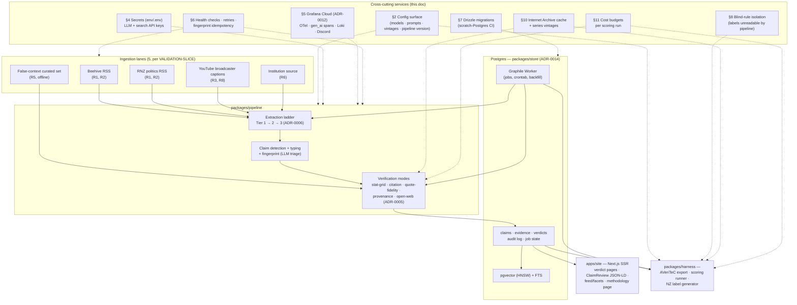

# Cross-cutting design

*Proposed. ADRs: 0005, 0006, 0011, 0012, 0014. Companions: `ARCHITECTURE.md`, `VALIDATION-SLICE.md`, `TEST-STRATEGY.md`, the component designs in `docs/design/`.*

Concerns that span every component: config, prompts, secrets, observability, error handling, schema policy, the blind-rule boundary, environments, backups, cost. This doc does not re-derive component behaviour — it defines the shared mechanisms and the test posture for each. Stack per ADR-0014: TypeScript (Vercel AI SDK), Postgres (pgvector + FTS), Drizzle, pnpm monorepo, Graphile Worker for job scheduling/queueing (STORE §2.3). Guardrails (lint/format/tests/CI pipelines) live in `TOOLCHAIN.md`. Test layers L1–L4 per `TEST-STRATEGY.md` §2.

## 1. Component map



The harness is a *consumer* of the store and config, never of the pipeline's runtime process — the separation §8 makes structural.

**Test risks:** the map drifts from reality (a lane added without wiring its cross-cutting services) → L1 asserts each lane emits funnel events + gen_ai spans at instantiation ("instrumentation ships with the lane" is a test, not a convention); the harness couples to pipeline runtime → L1 dependency-direction test (`packages/harness` must not import `packages/pipeline`).

## 2. Configuration & pinning (the reproducibility contract)

One typed config surface in-repo (loaded by `packages/llm` and the harness) carries every value a scoring run depends on:

| Config key | Change gated by |
|---|---|
| `models.{role}` + `model_versions.{role}` (ADR-0011 routing) | L3 run; ADR-0011 decision rule |
| `prompts.{task}` (version ref → §3 files) | L2 snapshot diff |
| `grid_axes_version` (pre-declared axes, ADR-0005) | L2 + L3 |
| `data_vintages` (per authority) | pinned per run |
| `pipeline_version` | derived (package version + git SHA) |
| `search_config` (provider, authority-restriction maps) | L2 |
| `latency_class` routing (batch vs interactive) | L1 |

**The reproducibility contract:** a scoring run's output is stamped with the tuple `(pipeline_version, model_versions, prompt_versions, grid_axes_version, data_vintages, search_config)`. The methodology page renders the published accuracy table *from the harness output file carrying that tuple* — generated, never hand-edited. No provider silent upgrades: any provider model-version change re-runs the harness before adoption (ADR-0011).

**Test risks:** config defaults diverge across dev/CI/slice → L1 asserts the effective config matches a checked-in expected tuple; L2 pins the tuple so drift is a visible verdict diff · run outputs missing the provenance tuple → L1 schema validation fails them; L4a renders only tuple-carrying files · silent provider upgrade → L2 catches behavioural drift; L3 re-runs on version change.

## 3. Prompt management

Prompts are code (ADR-0012): versioned files under `packages/llm/prompts/`, one per role (triage, fingerprint, citation check, quote-fidelity, adjudication, NLI audit, second-opinion).

- **Change = PR.** Git history is the version record; no vendor prompt UI (prompt changes are model-equivalent changes per ADR-0011).
- **Every stored artefact and harness output records the prompt versions used** — first-class provenance.
- **Published** on the methodology page — the exact prompt text a verdict used is inspectable.
- **L2 link:** the ~20-claim golden set runs per PR with pinned prompts; a prompt edit produces a snapshot diff the reviewer reads *before* approving. A change that flips a golden verdict without justification does not merge.
- **Harness-gated:** any prompt change re-runs L3; the per-stratum gate applies.

**Test risks:** prompt edited without a version bump → L1 asserts file hash matches the recorded version; L2 diff makes mismatches visible · prompt drift between what ran and what was scored → L2 uses the same config surface as production, one source · unreviewed tweak degrades a stratum → L3 gate.

## 4. Secrets & API access

Env + `.env` (gitignored), no Vault (ADR-0014). Key surface: the ADR-0011 providers actually routed (Anthropic, OpenAI, Google, aggregators, Brave, Serper).

| Concern | Rule |
|---|---|
| Storage | `.env` locally; GitHub Actions secrets in CI; env files on the slice host outside the repo |
| Repo hygiene | No key material in config, prompts, fixtures, or snapshots; `.env` gitignored from commit one |
| Scope | One key per provider per environment; no shared keys between dev and slice |
| Rotation | Keys rotated if ever committed — revoke + rotate, not history scrub |
| Egress | All payloads to model/search APIs are public material (ADR-0011's honest framing); no submitter PII exists in the slice |
| Serving-mode pinning | Routing config records aggregator serving mode (own infra vs passthrough-to-origin) per the foreign-operator rule |

**Test risks:** key committed → CI secret-scanning on every push · tests hitting paid APIs → L1 mocks all LLM/search calls; CI fails if a test resolves a live provider without `LIVE_EGRESS=1` · dev/slice sharing keys → per-environment keys; cost dashboards tag by environment; budgets alert on unexpected spend.

## 5. Observability & cost telemetry

One platform (Grafana Cloud), instrumented once with OpenTelemetry (ADR-0012). A lane without funnel events, gen_ai spans, and structured logs is not done.

### 5.1 Telemetry spine

| Signal | Pipeline | Backing store | Notes |
|---|---|---|---|
| Traces + `gen_ai.*` spans | OTel SDK → collector → Tempo | nested verification-loop traces (question decomposition → retrieval rounds → grid computation → verdict → NLI audit) as one trace | one trace per verdict attempt |
| Metrics | Prometheus-style via OTel | per-source rates queryable as "this week vs same week last month" | long retention, low cardinality |
| Logs | structured JSON → Loki | provenance fields (pipeline version, model version, extraction tier, claim/source IDs) as first-class labels | 50 GB/month free tier |
| Errors | exceptions as structured log events, grouped by fingerprint | stack trace + tags (lane/source/stage/pipeline-version); **no claim text in payloads** | log-based grouping accepted (ADR-0012) |
| Alerts | Grafana alert rules (versioned config, reviewable like code) | warnings batch to Discord; page-level conditions notify directly | alert fatigue is a design constraint |

No proprietary SDKs — any component movable to self-hosted Grafana OSS (any Docker host) as a config change if free-tier limits bite.

### 5.2 The funnel (store is truth, events are live)

Every stage boundary is a measurable rate, counted per lane × source × stage:

```
fetched → extracted (tier 1/2/3) → attributed (person/party/unattributed)
        → deduped (new claim / repeat occurrence) → triaged (checkable / dropped)
        → queued → verified (per verdict class) → published (versioned)
```

| Metric | Catches |
|---|---|
| fetch success rate per source | dead feeds, bot walls appearing |
| **Tier-2 fallback rate** per source | markup drift (the ladder's monitoring instrument) |
| extraction-empty-from-known-nonempty rate | generic-parser failure class |
| **unattributed rate** per lane | entity-resolution degradation |
| repeat-occurrence ratio | dedupe health; claim-traffic signal |
| triage drop-rate shift | claim-detection drift |
| verdict-class distribution shift | verification drift, visible before the harness catches it |
| **NLI audit failure rate** | justification hallucination; above noise pages a human |
| contest + mutation rate | public-trust engagement; audit-sample denominator |

Two sources, deliberately: OTel events give the live view for operational alerting; a store-SQL view gives reconcilable historical truth. A daily reconciliation job alerts on drift — dashboards disagreeing with the store means instrumentation bugs, which is itself monitored.

### 5.3 Cost + LLM telemetry

Every LLM call emits a `gen_ai.*` span: prompt, model, tokens, cost, latency, parent-span linkage. One span stream powers three views: the nested verification trace (Tempo), cost per role × model (ADR-0011 dashboard), and **cost per claim per stratum** (spans tagged with stratum labels at harness time; dashboard aggregates spend ÷ claims — feeding the VALIDATION-SLICE table alongside accuracy).

### 5.4 Scheduled jobs

Batch jobs (L3 runs, health re-probes, reconciliation) fail by *silence* — a job that never ran emits nothing to count. So: heartbeat + duration/status metrics, long-running reprocesses emit progress, and no-data/dead-man's-switch alerts fire on the absence of a heartbeat, not on an error.

### 5.5 Dashboards

| Dashboard | Panels |
|---|---|
| Funnel | counts per stage × lane × source; event-vs-store reconciliation status |
| Extraction health | Tier-2 fallback rate, extraction-empty rate, fetch success |
| Cost | per role × model; per claim per stratum; 80%-of-plan alert |
| Verification tripwires | verdict-class shift, NLI failure rate, triage drop-rate, repeat ratio, unattributed rate |
| Job health | `graphile_worker.jobs` run history, heartbeat/silence |

**Not here:** site/user analytics (separate privacy decision, ADR-0012), model-quality metrics (funnel shifts are tripwires; the harness measures accuracy), prompt-editing UI (§3).

**Test risks:** a lane runs without spans → L1 instrumentation-completeness test; daily reconciliation alerts on event-vs-store drift · cost telemetry lies (stale pricing, missing fields) → L1 middleware tests with fixture pricing; L3 cost cross-checked against provider billing · dashboards silently stop (free-tier limit) → no-data alerts; OTel makes the self-hosted migration a config change · alerts fire on silence, not just error → no-data conditions asserted in fixture runs.

## 6. Error handling, retries & idempotency

Per ADR-0006 the pipeline is idempotent at every stage boundary, raw inputs retained.

| Mechanism | Scope | Behaviour |
|---|---|---|
| Document content hash | ingestion | Identical re-fetch → no new row; provenance updated. Ingest re-runs produce no duplicates. |
| Claim fingerprint + embedding | triage/store | The dedupe-by-claim contract: repeats gain a source-occurrence, never a new queue entry. The cross-component idempotency key — re-running any stage re-resolves to the same claim record. |
| Append-only verdicts | verification/store | Reprocessed verdicts append a version with provenance; never overwrite. |
| Job idempotency keys | scheduler | Graphile Worker job keys — the same job re-enqueued with the same key updates rather than duplicates; `SKIP LOCKED` claiming — no double-verification. |
| Fetch retry ladder | all lanes | retry → headless fallback → degraded → maintainer alert → public coverage page. |
| Health checks | lanes | liveness (200-but-zero-items is a distinct alarm), drift detection, volume bands; extraction failures alertable like fetch failures. |

**Ingest re-run invariant:** re-running any lane over the same sources yields the same claim set — no duplicates, at most new source-occurrences and updated provenance. Directly tested.

**Test risks:** ingest re-run duplicates claims → L1 double-run test (identical counts/IDs); L2 golden re-run asserts stable fingerprints · retry ladder loops/double-fetches → L1 fixture HTTP failure modes (429, 5xx, bot-wall 200) assert bounded retries · concurrent double-writes → L1 concurrency test; unique constraints as backstop · dead lane unnoticed → L1 asserts each monitor registered; silence alerts verified pre-launch.

## 7. Schema & migration policy

Typed Drizzle schema in `packages/store`, shared end-to-end; migrations generated by drizzle-kit, reviewed as SQL, applied in order. The append-only store and permanent audit log demand forward-compatible evolution — never ad-hoc DDL.

**Shared versioning with the harness:** the label schema is part of the storage schema — designed together, versioned together (TEST-STRATEGY §1). The harness export carries a schema version; a store change that alters exported shapes bumps it.

**Migrations run in CI against a scratch Postgres before merge** — the schema-drift alarm.

**What requires an L3 re-run:**

| Change | Re-run? |
|---|---|
| Claim/verdict/evidence export shape changes | Yes |
| Label schema change | Yes + published dataset version bump |
| Any prompt change | Yes (L2 first, then L3) |
| Any model/version change | Yes (ADR-0011) |
| Grid-axes re-declaration | Yes |
| Retrieval source / authority-map change | Yes |
| Internal query/index changes, no exported-shape impact | No — CI migration + L1 suffices |
| Funnel/dashboard changes | No — reconciliation verifies store-agreement |

**Test risks:** CI/slice environment parity (version, extensions) → CI Postgres pinned to the slice host's version + extension set; L1 applies all migrations from zero on every PR · migration mutates historical rows → migration-review checklist asserted in tests (any UPDATE/DELETE on verdict/audit tables fails review) · harness/pipeline schema versions drift → L1 asserts export schema version == store schema version; mismatch fails the run before scoring.

## 8. Blind-rule isolation

The blind rule (EVALUATION §3): the pipeline never accesses labels; labels never change to suit the pipeline. Enforced **structurally**:

- Labels live on a separate storage path with **no grants to the pipeline process identity**.
- The harness runs as a distinct identity; nothing in `packages/harness` imports `packages/pipeline` (dependency-direction test, both directions per the attribution-firewall pattern).
- Label content never enters pipeline retrieval paths — indexes built only over pipeline-owned tables.

HARNESS.md owns the full mechanism. Cross-cutting commitments: the boundary is testable from L1, and no config-surface item may leak label data into pipeline configuration.

**Test risks:** the boundary erodes via a "convenience" grant during debugging → L1 permission-assertion test against a migrated scratch DB (connect as pipeline role, attempt read, assert denial) — cheap and permanent · label content smuggled through config/fixtures → L1 asserts no label-typed config fields; L2 fixtures are hand-curated claims only · shared helpers import both ways → dependency-direction test runs both directions.

## 9. Environments & deployment

Hosting-agnostic by construction: the deployment unit is **Docker Compose** — `site`, `pipeline-worker`, `harness-worker`, Postgres (pgvector), Graphile Worker — so any Docker host works: a homelab VM behind Cloudflare (our default), a single VPS, or a cloud instance. Paid services are LLM + search APIs and Grafana Cloud only (ADR-0012); contributors choose the architecture that suits their context, and the compose file is the only hosting commitment the repo makes.

| Environment | Where | Postgres | LLM/search | Runs |
|---|---|---|---|---|
| Dev | workstation | `docker compose` service | mocked or real per-test | L1 |
| CI | GitHub Actions | scratch (pinned version + extensions) | mocked | L1 + L2 + L4a per PR |
| Slice | any Docker host (ours: homelab VM behind Cloudflare) | compose service | real APIs, batch-routed | live ingestion, site, L3, L4b |

**Scoring-run triggering (D3):** L2 fires per PR in CI. L3 runs weekly + pre-release, batch-routed (`latency_class: batch`), scheduled as a Graphile Worker crontab entry → harness worker. A release tag's CI requires a green L3 in-window before deploy. Run outputs land in versioned files the methodology page renders.

Deployment is deliberately boring: `docker compose up` from a versioned image tag; the compose file doubles as the deployment runbook.

**Test risks:** CI/slice parity drift → pinned CI Postgres; L4b smoke after each deploy · weekly L3 silently stops → dead-man's-switch on the job heartbeat · release ships without a fresh run → L4 asserts the table's run timestamp is in the release's freshness window · dev misconfig hits the slice DB → per-environment config; L1 asserts resolved environment matches the ambient flag.

## 10. Backups & evidence durability

Durable assets (ARCHITECTURE §7): verdict store, audit log, labelled datasets.

- **IA caching**: evidence URLs cited in verdicts and labels cached at verification/labelling time — evidence must survive link rot for contestation.
- **Series vintages**: stored with vintage dates — provenance, not a live guarantee. We capture source, time, and the stats a verdict used; we do **not** re-verify third-party datasets on an ongoing basis. If an authority revises a series, the recorded vintage still states exactly what the verdict relied on, and users contest the verdict with the newer figures.
- **Raw-document retention** (ADR-0006): the enabling cost for reprocessing.
- **Backups**: nightly Postgres dumps, off-box (second node or object storage); restore-tested. The schedule runs **outside the election lifecycle** — backups are ordinary ops hygiene, so freeze-window crunch never competes with them.

**Test risks:** backups unrestorable → scheduled restore drill (row counts + audit-log integrity asserted) · IA caching silently failing → L1 fixture test on the cache step; success-rate alert · vintages missing → L1 schema constraint (series rows require a vintage).

## 11. Cost controls

Tiered routing (cheap bulk roles, premium verdict roles), batch APIs for ~80–90% of token spend, cost telemetry from gen_ai spans.

| Control | Mechanism | Threshold |
|---|---|---|
| Golden-set tier | ~20 claims per PR | soft cap; a runaway L2 fails the PR on cost-estimate check |
| Full-run tier | L3, ~$10–20/run | **$25/run hard cap**; over-cap projection requires explicit override |
| Campaign budget | ~$2–4K total cycle | alert at 80% of plan (ADR-0012 committed) |
| Run-cost anomaly | cost/claim per stratum vs trailing baseline | anomalous stratum cost pages |
| Batch discipline | `latency_class` routing | a realtime-lane spend spike is itself alertable |

**Test risks:** runaway loop burns budget → L1 depth-bounds tests; pre-run cost projection; anomaly alert as backstop · telemetry undercounts (batch jobs, cache hits, aggregator fees) → L3 cost cross-checked against provider billing each run · L2 cost creeps up as prompts grow → L2 cost trended per run; prompt-size regressions show as L2 cost deltas.

## 12. Cross-cutting risk register
| ID | Risk | Consequence if untested | Detection signal |
|---|---|---|---|
| CRO-R1 | Config tuple diverges across dev/CI/slice | Scoring runs unreproducible | L2 snapshot diff; L1 config-resolution test |
| CRO-R2 | Run output lacks the provenance tuple | Methodology renders numbers with no reproducibility trail | L1 schema validation on harness output |
| CRO-R3 | Provider silently upgrades a model | Behaviour changes without a harness gate | L2 golden drift; ADR-0011 re-run rule |
| CRO-R4 | Prompt edited without version bump; provenance lies | Verdicts cite prompts they didn't use | L1 hash-vs-config assertion |
| CRO-R5 | API key committed | Credential leak; cost/abuse exposure | CI secret-scanning |
| CRO-R6 | Tests or dev silently hit paid APIs | Nondeterministic tests; surprise billing | L1 live-egress flag assertion |
| CRO-R7 | Lane ships without instrumentation | Silent funnel gaps — the "fails silently" class ADR-0012 exists to kill | L1 instrumentation-completeness test per lane |
| CRO-R8 | Cost telemetry miscalculates | Budget decisions on false numbers | L1 middleware tests; L3 vs billing cross-check |
| CRO-R9 | Ingest re-run duplicates claims | Corrupted claim graph; doubled spend | L1 double-run idempotency test |
| CRO-R10 | Retry ladder misbehaves (infinite loop, double-fetch, silent degraded) | Sources silently degraded | L1 failure-class fixture tests |
| CRO-R11 | Concurrent workers double-write verdicts | Append-only violated | L1 concurrency test + unique constraints |
| CRO-R12 | Migration breaks append-only (mutates history) | Permanent record corrupted | L1 migration checklist (no DML on historical rows) |
| CRO-R13 | Store and harness export schema drift | Harness scores shapes production no longer emits | L1 schema-version equality assertion |
| CRO-R14 | Blind-rule boundary eroded | Scoring tunable against labels — the harness stops measuring anything | L1 permission-denial test; dependency-direction test |
| CRO-R15 | Environment parity drift (CI vs slice) | Migrations pass in CI, fail in production | Pinned CI Postgres; L4b deploy smoke |
| CRO-R16 | Scoring run silently skipped or stale | Published accuracy goes stale unnoticed | Dead-man's-switch; L4 release-gate timestamp assertion |
| CRO-R17 | Backups unrestorable; IA caching failing; vintages missing | Evidence rot — contestation impossible post-hoc | Restore tests; cache alert; vintage constraint |
| CRO-R18 | Runaway loop burns budget | Campaign budget blown mid-cycle | L1 depth-bounds tests; cost projection; anomaly alert |
| CRO-R19 | Alerts only fire on errors, never on silence — a dead cron job emits nothing to alert on | Jobs fail invisibly for days (the exact ADR-0012 failure class) | L1 asserts no-data conditions on heartbeat metrics; silence alerts verified pre-launch |

## 13. Consolidated test-risk register (all components)

Layers per TEST-STRATEGY §2; gates: CI per push/PR, L3 per-stratum gate, L4b release gate. This is the single index of "what must pass before merge, for which risk."

| Component doc | Risk IDs | Layers beyond L1 | Merge gate |
|---|---|---|---|
| INGESTION.md | ING-R1…R14 | L2 (R1, R7, R11); L4a (R4) | CI every push; golden diffs per PR |
| TRIAGE.md | TRI-R1…R13 | L2 (R7, R10, R13); L3 (R1–R3, R5, R9, R10) | CI; golden diffs; drop-recall + per-type accuracy in L3 |
| VERIFICATION.md | VER-R1…R15 | L2 (R7, R10, R13); L3 (R2–R5, R8, R10–R12, R15); L4a (R6, R9) | CI; golden diffs; per-stratum L3 gate |
| STORE.md | STO-R1…R19 | L2 (R5, R11, R12, R16); L3 + Graphile Worker (R3, R19); ops drills (R8, R10) | CI; migration CI job on store changes; blind-rule re-verified pre-release; restore drill monthly |
| SITE-MVP.md | SIT-R1…R14 | L2 (R4); L4a (all); L4b (R3) | CI incl. L4a smoke; release gate pre-release |
| HARNESS.md | HAR-R1…R12 | L3 (R2, R3, R6–R8, R11); L4b (R9) | CI; L3 weekly + pre-release; publication requires accepted-run tag |
| TOOLCHAIN.md | TOO-R1…R8 | L1 (all); ops (R4–R6) | CI per push/PR; weekly security cron; dead-man's alert on missing security run |
| CROSS-CUTTING.md | CRO-R1…R19 | see §12 mapping | CI per push/PR; L3 weekly; L4b release gate |

**Totals: 114 risks across 8 docs** (ING 14, TRI 13, VER 15, STO 19, SIT 14, HAR 12, CRO 19, TOO 8). No duplicate IDs. TRI-R3/VER-R15 are complementary views of one routing risk, both gated. Known cross-doc twins, intentionally paired: VER-R13 ↔ STO-R12 (fingerprint drift) · CRO-R12 ↔ STO-R1 (append-only) · CRO-R13 ↔ STO-R7/HAR-R5 (schema drift) · CRO-R17 ↔ STO-R3 (evidence rot) · CRO-R14 ↔ HAR-R1 (blind rule) · VER-R8 ↔ CRO-R18/HAR-R8 (cost) · CRO-R19 ↔ STO-R19 (worker silence).

## 14. Open questions

| # | Question | Notes |
|---|---|---|
| 1 | Vintage pinning mechanics: replay stored series at the recorded vintage, or pin a snapshot set at run time? | Affects harness design and store query surface. No re-verification job — vintages are recorded provenance (§10). Leans replay-from-store |
| 2 | Config surface: one typed module in `packages/llm`, or per-package files with a shared loader? | ADR-0014 fixes the stack, not the layout |
| 3 | Secret-scanning tooling: GitHub built-in vs gitleaks in CI | Either satisfies the gate |
| 4 | Alert routing + paging thresholds beyond ADR-0012's defaults at slice scale | Slice-specific thresholds untested |
| 5 | Scoring-run trigger ownership: Graphile Worker crontab + manual pre-release trigger, or a release-pipeline step? | D3 fixes cadence, not mechanism |
| 6 | Backup off-box target: second Docker host vs object storage; retention policy | §10 assumes off-box copies exist |
| 7 | Label-schema version publication: does it ride in the run tuple and the published dataset? | Follows from TEST-STRATEGY §1 |
| 8 | Does the false-context curated set run through the normal config surface or a pinned offline manifest? | Not a live lane; leans offline manifest |
| 9 | Site analytics (Plausible/Matomo) — out of ADR-0012's scope; when is the decision made? | Site MVP ships without it per VALIDATION-SLICE |