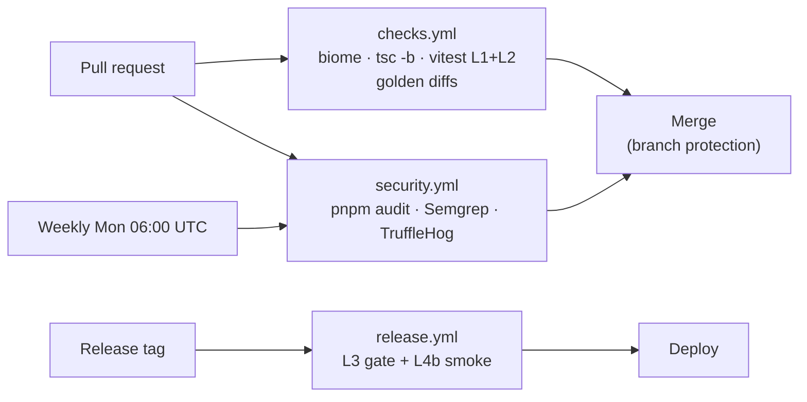

# Toolchain & CI guardrails

*Proposed (Draft 1). ADR-0014 pins the stack; this doc pins the guardrails — the tools, rules, and pipelines every change passes before merge. Working reference: [election-night](https://github.com/bradleyscott/election-night) (same maintainer; CI shape proven in production).*

## 1. Purpose and slice scope

Everything verifiable returns pass/fail in CI before merge. The verification layer has three strata:

| Layer | What | Canonical home |
|---|---|---|
| Functional contracts | L1–L4 test layers, golden diffs, gates | `TEST-STRATEGY.md` — not re-derived here |
| Structural contracts | Format, lint, import boundaries, dependency hygiene, secret/supply-chain scans | This doc |
| Governance | Architectural taste, ADR decisions, threshold changes | Human review per `CONTRIBUTING.md` — deliberately not automatable |

Principle (the Go community's decade-long experiment): **if a tool can enforce it, a human shouldn't review it.** Formatting is never a review topic; a boundary violation is a red CI run, not a PR comment.

The slice ships the *specification*. Workflow files land with the first code PR (October 2026, per CONTRIBUTING) and gate merges from that commit.

## 2. Design

### 2.1 Toolchain

| Concern | Tool | Notes |
|---|---|---|
| Packages | pnpm 10, `packageManager` pinned | ADR-0014; `--frozen-lockfile` in CI |
| Format + lint | Biome — one binary, both jobs | Closest TS equivalent to `gofmt`: one formatter, no style debates. Diverges from election-night's ESLint+Prettier (open question 1) |
| Typecheck | `tsc -b` project references | `packages/store` builds first; strict; Zod schemas are the boundary types |
| Tests | Vitest workspace, `vitest run --forbid-only` | L1+L2 on every PR; L3/L4 cadence per TEST-STRATEGY |
| Dependency hygiene | Dependabot (weekly Mon, 7-day cooldown, grouped) + `pnpm audit --audit-level=high` | Groups prevent PR floods; high-severity gate only |
| Code analysis | Semgrep `p/ci` in container | |
| Secrets | TruffleHog `--only-verified`, full history | Near-zero false positives; GitHub push-protection as second layer |
| CI | GitHub Actions; actions SHA-pinned with version comments; Node via `node-version-file` | election-night pattern |

### 2.2 Pipelines

| Workflow | Trigger | Jobs |
|---|---|---|
| `checks.yml` (reusable) | every PR; callable | `pnpm install --frozen-lockfile` → `biome check` → `tsc -b` → `vitest run --forbid-only` → golden diffs |
| `security.yml` (reusable) | every PR + weekly cron | pnpm audit → Semgrep → TruffleHog |
| `release.yml` (post-slice) | release tag | L3 in-window gate + L4b smoke per TEST-STRATEGY D3, then deploy |

Branch protection: `check` + `security` required on `main`. The migration CI job (drizzle → scratch Postgres before merge) triggers on `packages/store/**` via paths-filter — the STORE §2.4 commitment; its plumbing is defined here.

### 2.3 Import boundaries — the load-bearing structural contract

The blind rule (ADR-0002) is enforced three ways; lint is the first, cheapest gate:

1. **Lint (this doc):** Biome `noRestrictedImports` per-package overrides — `packages/pipeline` cannot import `@claimwatch/harness`. Full boundary table: HARNESS §3.
2. **Runtime:** env-var assertion + separate DB role (HAR-R1).
3. **Integration test:** CI connects as `pipeline_role` and asserts every labels read fails.

Suppression policy: `// biome-ignore …: reason` — reason mandatory, enforced by a CI grep. Loosening a boundary rule requires a matching edit to this doc, so the change is visible in review.

## 3. Interfaces and contracts

| Script | Does | CI equivalent |
|---|---|---|
| `pnpm verify` | format check + lint + typecheck + tests | everything in `checks.yml` |
| `pnpm format:check` / `pnpm lint` | `biome check` split for editors | step 2 |
| `pnpm typecheck` | `tsc -b` | step 3 |
| `pnpm test` | `vitest run --forbid-only` | step 4 |

No pre-commit hooks: CI is the single gate; hooks fork and rot. `pnpm verify` is local parity.

## 4. Test risks

| ID | Risk | Consequence if untested | Detection signal |
|---|---|---|---|
| TOO-R1 | Boundary lint silently disabled or loosened | Blind rule's first gate gone; contamination caught only at runtime | Suppression-reason grep; `biome.json` diff flagged in review; this doc must gain a matching line |
| TOO-R2 | `any` / `ts-ignore` creep | Zod-at-boundaries typing erodes; runtime surprises | tsc strict; grep gate for `ts-ignore` / `@ts-nocheck` |
| TOO-R3 | CI/local environment drift | Green CI, broken dev (or inverse); trust in checks decays | `packageManager` + `engines` + `node-version-file`; frozen lockfile |
| TOO-R4 | Dependabot flood | Update PRs rubber-stamped | 7-day cooldown; dev/prod groups; 10-PR cap |
| TOO-R5 | Audit gate disabled for noise | Vulnerable dependency ships | High-severity-only gate; exceptions live in one allowlist file, each with reason + expiry |
| TOO-R6 | Secret scan misses | Credentials in fixtures/prompts leak | TruffleHog verified-only + push-protection; weekly full-history run |
| TOO-R7 | Migration CI never wired | First migration merges unreviewed | Paths-filtered job on `packages/store/**`; blocks merge |
| TOO-R8 | Skipped/only tests in CI | Suite silently shrinks | `--forbid-only`; grep gate for `.skip` |

## 5. Test strategy

| Risk | Mitigation | Layer |
|---|---|---|
| TOO-R1, R2, R8 | Grep gates + forbid-only in the shared check job | L1 |
| TOO-R3 | Pinned toolchain validated in CI install step | L1 |
| TOO-R4–R6 | Workflow configs reviewed like code; dead-man's alert if no security run in 10 days | L1 + ops |
| TOO-R7 | Fixture: drizzle migrations apply clean to scratch Postgres seeded with store schema | L1 |

## 6. Open questions

| # | Question | Notes |
|---|---|---|
| 1 | Biome vs election-night's exact ESLint+Prettier parity | Biome is ADR-0014's pick and the gofmt-style single tool; ESLint wins only if we need plugin rules (e.g. vitest-specific lint). Flip here if parity is preferred — a mechanical change |
| 2 | Semgrep ruleset beyond `p/ci` (e.g. `p/typescript`, custom rules for prompt handling) | Start with `p/ci`; add when first code lands |
| 3 | Complexity/file-size thresholds | Complexity default 15; file-length cap ~400 — tune on real code, not speculatively |